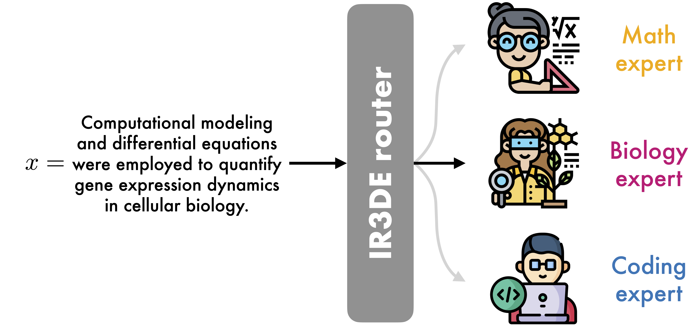

# IR3DE: A Linear Router for Large Language Models

This repository contains the code and instructions needed to reproduce the experiments from the paper "_[IR3DE: A Linear Router for Large Language Models](https://arxiv.org/pdf/2606.06098)_", accepted at the Resource-Adaptive Foundation Model Inference (AdaptFM) Workshop at ICML 2026.



Foundational Large Language Models (LLMs) excel at a broad spectrum of generalist tasks and achieve impressive results on specialized ones with domain-expert LLMs. As the number of available LLMs continues to grow, inference routers are increasingly used to select the most suitable model for each prompt. However, existing routing methods either focus on cost optimization across generalist LLMs of varying strengths or demand extensive training to enable domain-expert routing. In this work, we introduce IR3DE, a Ridge Regression-based Router for Domain Experts that offers efficient and cost-effective routing decisions for each prompt. We evaluate IR3DE in two Causal Language Modeling (CLM) scenarios: next-token prediction across multiple domains, and a reasoning scenario where each domain features a distinct reasoning task. Despite its linear nature, IR3DE matches baseline performance in both CLM scenarios and surpasses them in the reasoning scenario, achieving a normalized performance of 98.4\%. Furthermore, IR3DE allows domain experts to be added or removed without retraining the router from scratch, enabling a dynamic set of LLMs to be served with minimal disruption.

## Get started

For the environment and the datasets, please follow [this](https://github.com/gensyn-ai/dume/blob/main/README.md) guide.

### Download pre-trained M2D2 Llama 115M experts

```python download_models.py```

## Citation

```
@misc{fani2026ir3de,
  title={IR3DE: A Linear Router for Large Language Models},
  author={Fan{\`i}, Eros and Ersoy, O{\u{g}}uzhan},
  eprint={2606.06098},
  archivePrefix={arXiv},
  primaryClass={cs.CL},
}
```
